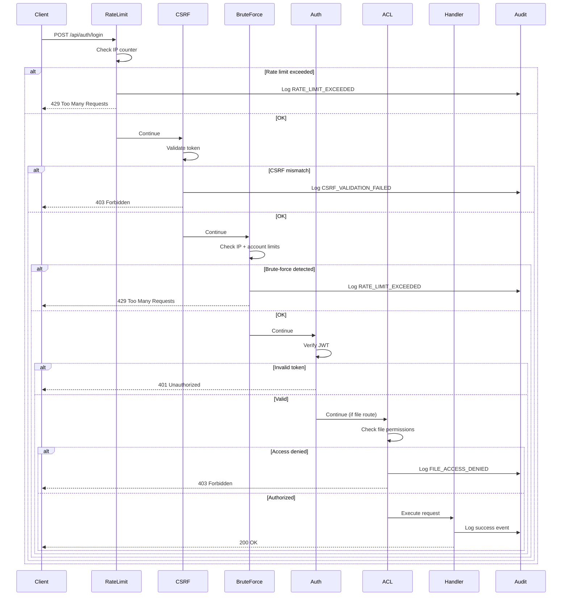
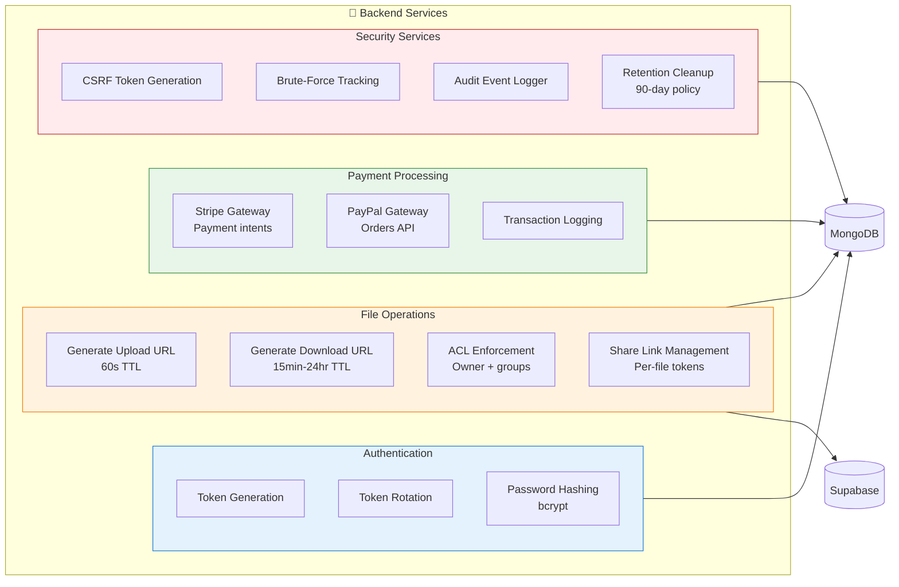
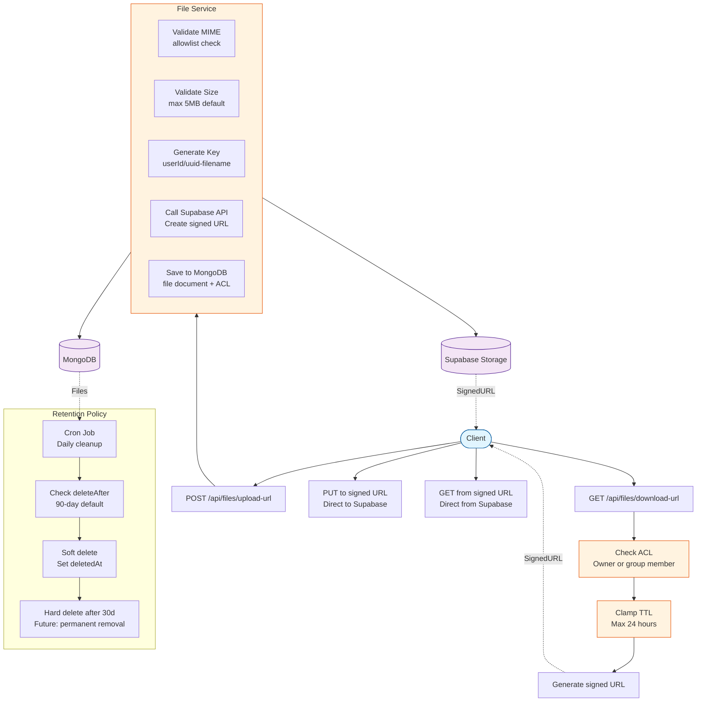

# Architecture Diagram - Multi-Gateway Platform

**System architecture with security layers, services, and CI/CD pipeline**

---

## Table of Contents

1. [Complete System Diagram](#complete-system-diagram)
2. [Security Middleware Layer](#security-middleware-layer)
3. [Service Layer Diagram](#service-layer-diagram)
4. [Storage Architecture](#storage-architecture)
5. [CI/CD Pipeline](#cicd-pipeline)

---

## Complete System Diagram

```mermaid
graph TB
    %% User Layer
    User([👤 User Browser]) --> HTTPS{HTTPS}
    HTTPS --> NextJS
    
    %% Frontend Layer
    subgraph Frontend ["🌐 Frontend (Next.js 16.1.1)"]
        NextJS[Next.js App Router]
        NextUI[UI Components<br/>port 3000]
        NextAPI[Next.js API Routes<br/>/api/storage, /api/test]
        NextConfig[Security Headers<br/>CSP, X-Frame, HSTS]
        
        NextJS --> NextUI
        NextJS --> NextAPI
        NextJS --> NextConfig
    end
    
    %% Security Middleware Layer
    NextAPI --> SecurityLayer
    
    subgraph SecurityLayer ["🛡️ Security Middleware"]
        RateLimit[Rate Limiter<br/>5 req/15min auth<br/>100 req/min webhooks]
        CSRF[CSRF Protection<br/>Double-submit cookie]
        BruteForce[Brute-Force Protection<br/>10 IP / 5 account limits]
        Auth[JWT Auth<br/>15min access + 30d refresh]
        FileACL[File ACL Middleware<br/>Owner + group checks]
    end
    
    SecurityLayer --> ExpressAPI
    
    %% Backend API Layer
    subgraph Backend ["⚙️ Backend API (Express + TypeScript)"]
        ExpressAPI[Express Server<br/>port 5000]
        
        subgraph Routes ["📍 Routes"]
            AuthRoutes[/api/auth/*<br/>login, register, refresh]
            FileRoutes[/api/files/*<br/>upload-url, download-url]
            PaymentRoutes[/api/payments/*<br/>pay, authorize, capture]
            WebhookRoutes[/api/webhooks/*<br/>stripe, paypal]
            AuditRoutes[/api/audit-logs<br/>admin only]
        end
        
        subgraph Services ["🔧 Services"]
            RefreshTokenService[Refresh Token Service<br/>Token rotation]
            FileService[File Service<br/>Signed URLs, ACLs]
            PaymentService[Payment Service<br/>Stripe, PayPal gateway]
            AuditService[Audit Service<br/>Event logging]
        end
        
        ExpressAPI --> Routes
        Routes --> Services
    end
    
    %% Data Layer
    Services --> DataLayer
    
    subgraph DataLayer ["💾 Data Layer"]
        MongoDB[(🗄️ MongoDB 7.0<br/>users, files, transactions<br/>auditlogs)]
        Supabase[(☁️ Supabase Storage<br/>File objects<br/>Signed URLs)]
        Redis[(🔴 Redis 7.0<br/>Rate limit counters<br/>future: session store)]
    end
    
    %% External Services
    PaymentService --> StripeAPI[💳 Stripe API<br/>Payment intents]
    PaymentService --> PayPalAPI[💳 PayPal API<br/>Orders]
    StripeAPI -.Webhook.-> WebhookRoutes
    PayPalAPI -.Webhook.-> WebhookRoutes
    
    %% Monitoring Layer
    subgraph Monitoring ["📊 Observability"]
        OTel[OpenTelemetry Collector<br/>Traces]
        Prometheus[Prometheus<br/>Metrics]
        Jaeger[Jaeger UI<br/>Trace visualization]
        Sentry[Sentry<br/>Error tracking]
    end
    
    ExpressAPI --> OTel
    ExpressAPI --> Prometheus
    ExpressAPI --> Sentry
    OTel --> Jaeger
    
    %% CI/CD Layer
    subgraph CICD ["🚀 CI/CD Pipeline"]
        GitHub[GitHub Actions]
        
        subgraph Workflows ["Workflows"]
            CIWorkflow[ci-cd.yml<br/>Build + Test + Deploy]
            SecurityWorkflow[security-tests.yml<br/>SAST, secrets scan]
            HardenedWorkflow[ci-cd-hardened.yml<br/>Production deploy]
        end
        
        GitHub --> Workflows
    end
    
    GitHub -.Deploy.-> Frontend
    GitHub -.Deploy.-> Backend
    
    %% Styling
    classDef frontend fill:#e1f5ff,stroke:#01579b,stroke-width:2px
    classDef backend fill:#fff3e0,stroke:#e65100,stroke-width:2px
    classDef security fill:#ffebee,stroke:#c62828,stroke-width:2px
    classDef data fill:#f3e5f5,stroke:#4a148c,stroke-width:2px
    classDef external fill:#e8f5e9,stroke:#1b5e20,stroke-width:2px
    classDef monitoring fill:#fff9c4,stroke:#f57f17,stroke-width:2px
    classDef cicd fill:#e0f2f1,stroke:#004d40,stroke-width:2px
    
    class NextJS,NextUI,NextAPI,NextConfig frontend
    class ExpressAPI,Routes,Services backend
    class RateLimit,CSRF,BruteForce,Auth,FileACL security
    class MongoDB,Supabase,Redis data
    class StripeAPI,PayPalAPI external
   class OTel,Prometheus,Jaeger,Sentry monitoring
    class GitHub,Workflows cicd
```

---

## Security Middleware Layer

**Request flow through security middleware:**



**Middleware Chain:**
1. **Rate Limiter** → Checks IP-based request counts
2. **CSRF Protection** → Validates double-submit cookie
3. **Brute-Force Protection** → Tracks failed login attempts
4. **JWT Auth** → Verifies access token
5. **ACL Middleware** → Checks file permissions (file routes only)

---

## Service Layer Diagram



---

## Storage Architecture



**Key Features:**
- ✅ **Signed URLs:** Time-limited access (60s upload, 15min-24hr download)
- ✅ **ACL Enforcement:** Owner + group-based permissions
- ✅ **MIME Validation:** Allowlist for uploads
- ✅ **Size Limits:** Configurable max upload size
- ✅ **Retention Policy:** 90-day soft delete + audit logging
- ✅ **Share Links:** Per-file tokenized sharing

---

## CI/CD Pipeline

```mermaid
graph LR
    subgraph Developer ["👨‍💻 Developer"]
        GitCommit[git push<br/>feature/security-sprint]
    end
    
    GitCommit --> GitHub[GitHub Actions]
    
    subgraph CIWorkflow ["ci-cd.yml"]
        direction TB
        Checkout1[Checkout code]
        InstallDeps1[npm ci<br/>Root, backend, commerce-web]
        Lint1[ESLint + Prettier]
        TypeCheck1[TypeScript compile]
        UnitTests1[Jest unit tests]
        BuildBackend1[Build backend]
        BuildFrontend1[Build Next.js]
        
        Checkout1 --> InstallDeps1
        InstallDeps1 --> Lint1
        Lint1 --> TypeCheck1
        TypeCheck1 --> UnitTests1
        UnitTests1 --> BuildBackend1
        BuildBackend1 --> BuildFrontend1
    end
    
    subgraph SecurityWorkflow ["security-tests.yml"]
        direction TB
        Checkout2[Checkout code]
        SecretsHygiene[Secrets hygiene<br/>Detect hardcoded keys]
        SecurityHeaders[Validate CSP headers]
        RateLimitTest[Rate limit tests]
        StorageE2E[Storage E2E tests]
        AuditLogVerify[Audit log verification]
        
        Checkout2 --> SecretsHygiene
        SecretsHygiene --> SecurityHeaders
        SecurityHeaders --> RateLimitTest
        RateLimitTest --> StorageE2E
        StorageE2E --> AuditLogVerify
    end
    
    subgraph HardenedWorkflow ["ci-cd-hardened.yml"]
        direction TB
        Checkout3[Checkout code]
        InstallDeps3[npm ci --prefer-offline]
        AuditNPM[npm audit]
        SAST[SAST scan<br/>Semgrep]
        BuildProd[Production build]
        DockerBuild[Docker build]
        Deploy[Deploy to staging]
        SmokeTests[Smoke tests]
        
        Checkout3 --> InstallDeps3
        InstallDeps3 --> AuditNPM
        AuditNPM --> SAST
        SAST --> BuildProd
        BuildProd --> DockerBuild
        DockerBuild --> Deploy
        Deploy --> SmokeTests
    end
    
    GitHub --> CIWorkflow
    GitHub --> SecurityWorkflow
    GitHub --> HardenedWorkflow
    
    BuildFrontend1 -.Success.-> Artifact1[📦 Build Artifacts]
    AuditLogVerify -.Success.-> SecurityBadge[✅ Security Tests Pass]
    SmokeTests -.Success.-> Production[🚀 Production Ready]
    
    classDef devStyle fill:#e1f5ff,stroke:#01579b
    classDef ciStyle fill:#e0f2f1,stroke:#004d40
    classDef securityStyle fill:#ffebee,stroke:#c62828
    classDef hardenedStyle fill:#fff3e0,stroke:#e65100
    
    class Developer devStyle
    class CIWorkflow ciStyle
    class SecurityWorkflow securityStyle
    class HardenedWorkflow hardenedStyle
```



**Pipeline Stages:**

1. **ci-cd.yml** (Standard CI)
   - ✅ Dependency installation (npm ci)
   - ✅ Linting + formatting
   - ✅ TypeScript compilation
   - ✅ Unit tests (Jest)
   - ✅ Backend + frontend builds

2. **security-tests.yml** (Security Automation)
   - ✅ Secrets hygiene scan
   - ✅ Security headers validation
   - ✅ Rate limiting tests
   - ✅ Storage E2E tests
   - ✅ Audit log verification

3. **ci-cd-hardened.yml** (Production Deployment)
   - ✅ npm audit (dependency vulnerabilities)
   - ✅ SAST scan (Semgrep)
   - ✅ Production builds
   - ✅ Docker image creation
   - ✅ Staging deployment
   - ✅ Smoke tests

---

## Technology Stack Summary

| Layer | Technology | Purpose |
|-------|-----------|---------|
| **Frontend** | Next.js 16.1.1, React 19, TypeScript | Server-side rendering, API routes |
| **Backend** | Express.js, TypeScript, Node.js 20+ | REST API, middleware |
| **Database** | MongoDB 7.0 | Users, files, transactions, audit logs |
| **Storage** | Supabase Storage | File objects with signed URLs |
| **Cache** | Redis 7.0 | Rate limiting, future session store |
| **Payments** | Stripe, PayPal | Payment processing |
| **Monitoring** | OpenTelemetry, Prometheus, Jaeger | Traces, metrics, debugging |
| **Security** | JWT, bcrypt, CSRF tokens, rate limiting | Authentication, authorization |
| **CI/CD** | GitHub Actions | Automated testing, deployment |
| **Container** | Docker, docker-compose | Local development, production deployment |

---

## Component Ports

| Component | Port | Purpose |
|-----------|------|---------|
| Commerce Web (Next.js) | 3000 | Frontend UI + Next.js API routes |
| Backend API (Express) | 5000 | REST API gateway |
| MongoDB | 27017 | Database server |
| Redis | 6379 | Cache server |
| Jaeger UI | 16686 | Trace visualization |
| Prometheus | 9090 | Metrics dashboard |
| OpenTelemetry Collector | 4318 | Trace collection (HTTP) |

---

## File Locations

| Component | Path |
|-----------|------|
| **Frontend** | [commerce-web/](../commerce-web/) |
| **Backend** | [backend/](../backend/) |
| **Security Middleware** | [backend/src/middleware/](../backend/src/middleware/) |
| **Services** | [backend/src/services/](../backend/src/services/) |
| **Routes** | [backend/src/routes/](../backend/src/routes/) |
| **Models** | [backend/src/models/](../backend/src/models/) |
| **CI/CD Workflows** | [.github/workflows/](../.github/workflows/) |
| **Scripts** | [scripts/](../scripts/) |
| **Documentation** | [docs/](../docs/) |

---

**Last Updated:** February 10, 2026
