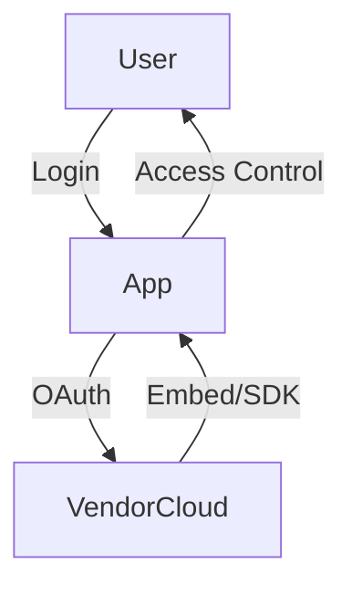
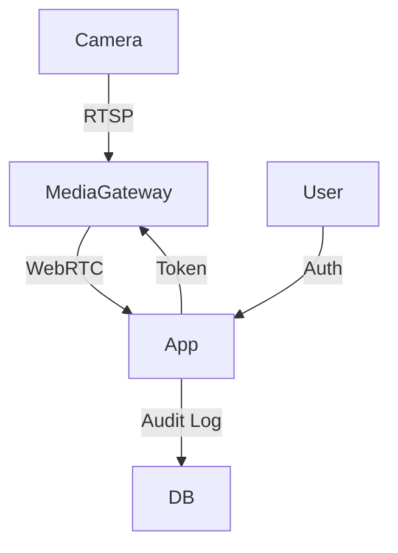
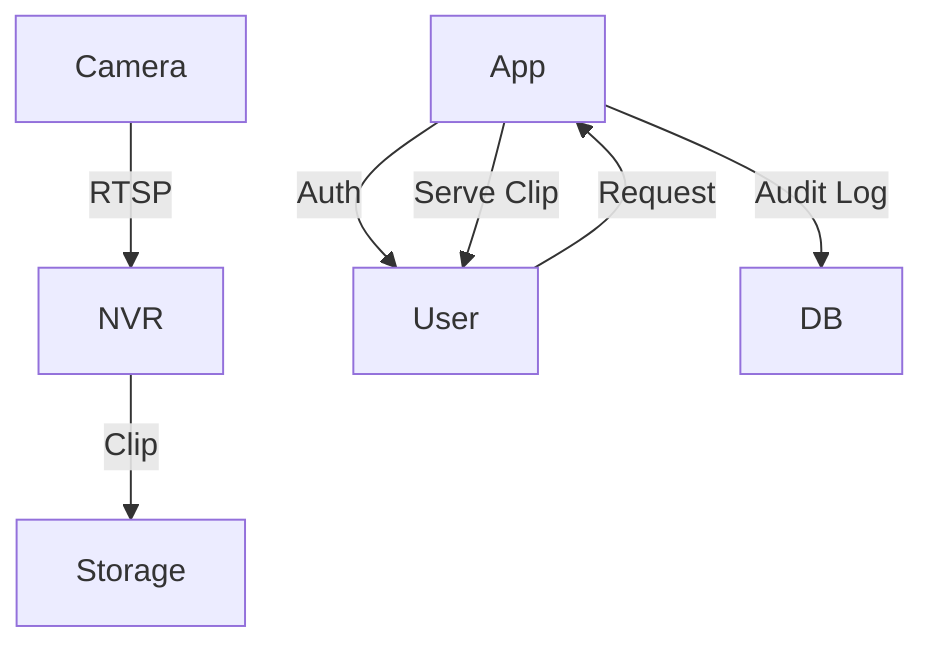

# CCTV/Webcam Safe Feature: Architecture Options

## Overview
This document explores three legitimate architecture options for securely integrating CCTV/webcam feeds into a web application. Each option is evaluated for authentication, access logging, privacy controls, operational complexity, and compliance. A simple architecture diagram is provided for each.

---

## Option 1: Vendor Cloud Embed / SDK
**Description:** Use a third-party CCTV/cloud camera vendor (e.g., Nest, Ring, Arlo, Hikvision) that provides embeddable video widgets or SDKs for web integration.

**Pros:**
- Fastest to implement (minimal backend work)
- Vendor handles video streaming, scaling, and security
- Minimal operational overhead
- Built-in mobile/web support

**Cons:**
- Limited control over data, features, and compliance
- Vendor lock-in
- Privacy and audit features depend on vendor
- May require exposing user data to third party

**Authentication Model:**
- OAuth/OpenID Connect with vendor
- Application authenticates user, then requests access token for video widget/SDK

**Access Logging/Auditing:**
- Relies on vendor’s logging (may be limited)
- Application can log widget loads/user actions

**Privacy Controls:**
- Viewer access managed by app roles/permissions
- Retention/consent policies depend on vendor
- Limited ability to enforce custom privacy rules

**Diagram:**

---

## Option 2: RTSP → Authorized Media Gateway → WebRTC Viewer
**Description:** Use an on-prem or cloud media gateway to ingest RTSP streams from cameras, transcode to WebRTC, and serve to authenticated web clients.

**Pros:**
- Full control over video pipeline
- Can enforce custom authentication, logging, and privacy
- No vendor lock-in

**Cons:**
- Requires media gateway setup (e.g., Ant Media, Jitsi, Janus)
- More operational complexity (scaling, updates, security)
- Must handle compliance and privacy in-house

**Authentication Model:**
- App authenticates user (JWT/session)
- Media gateway enforces token-based access to streams

**Access Logging/Auditing:**
- App logs user access requests
- Media gateway logs stream connections
- Centralized audit trail possible

**Privacy Controls:**
- Fine-grained access (per camera, per user)
- Retention/consent managed by app
- Can implement custom privacy features

**Diagram:**

---

## Option 3: NVR Integration + Clip Storage + Secure Sharing
**Description:** Integrate with a Network Video Recorder (NVR) system, store video clips securely, and provide controlled sharing/viewing via the app.

**Pros:**
- Best for compliance (retention, audit, consent)
- Full control over storage, access, and sharing
- Enables advanced privacy features (e.g., watermarking, access expiry)

**Cons:**
- Most complex to implement and operate
- Requires NVR integration, clip extraction, secure storage (e.g., S3), and sharing logic
- Must build/maintain full audit and privacy stack

**Authentication Model:**
- App authenticates user (SSO/JWT)
- Access to clips controlled by app roles/permissions

**Access Logging/Auditing:**
- All clip views/downloads logged in app
- Full audit trail (who, what, when)

**Privacy Controls:**
- Per-user/group access, consent tracking
- Retention policies, access expiry, watermarking
- User consent required for sharing

**Diagram:**

---

## Summary Table
| Option | Speed | Control | Compliance | Ops Overhead |
|--------|-------|---------|------------|--------------|
| Vendor Cloud | Fastest | Low | Vendor-dependent | Minimal |
| Media Gateway | Medium | High | App-enforced | Moderate |
| NVR+Clips | Slowest | Highest | Best | High |

---

## Recommendation
- **For MVP/fastest delivery:** Use vendor cloud embed/SDK, but review vendor’s privacy/compliance features.
- **For regulated/compliance-focused environments:** NVR+clip storage with full audit/privacy stack.
- **For balance of control and effort:** Media gateway approach.

---

## References
- [WebRTC Media Gateways: Ant Media, Janus, Jitsi](https://webrtc.org/)
- [NVR Compliance Best Practices](https://www.securitymagazine.com/)
- [OAuth 2.0 for Secure Video Embeds](https://oauth.net/2/)
